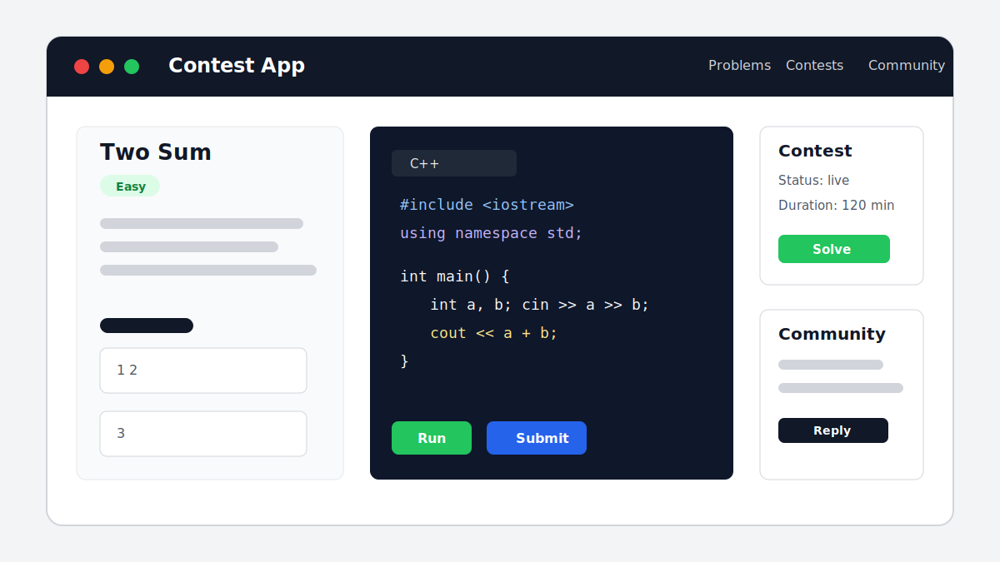
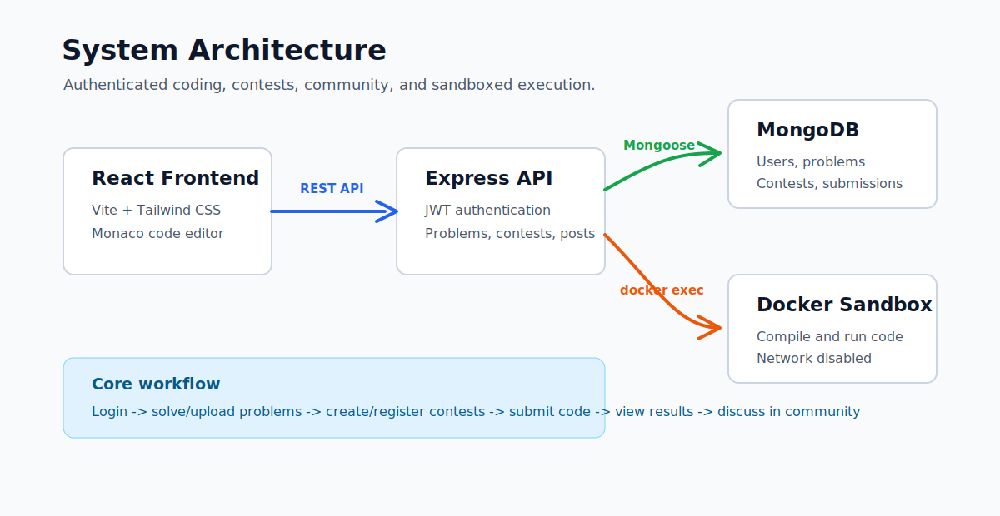

# Contest App

Contest App is a full-stack competitive programming platform. It lets users sign up, upload coding problems, solve problems in a Monaco editor, create timed contests from uploaded problems, register for contests, submit code through a Docker sandbox, view contest results, and discuss questions in a community section.



## Table of Contents

- [Features](#features)
- [Tech Stack](#tech-stack)
- [Architecture](#architecture)
- [Project Structure](#project-structure)
- [Prerequisites](#prerequisites)
- [Environment Variables](#environment-variables)
- [Setup](#setup)
- [Running the App](#running-the-app)
- [Docker Code Sandbox](#docker-code-sandbox)
- [API Overview](#api-overview)
- [Main Frontend Routes](#main-frontend-routes)
- [Important Workflows](#important-workflows)
- [Troubleshooting](#troubleshooting)

## Features

- Email and password authentication with JWT.
- Username is generated from the text before `@` in the user email.
- Login/logout state is stored on the frontend and sent with protected API calls.
- Authenticated users can upload coding problems with sample and hidden testcases.
- Problem list shows all uploaded problems.
- Monaco editor supports C++, C, Python, Java, and JavaScript selections.
- Code execution is performed inside a Docker container.
- Users can run sample testcases and submit against hidden testcases.
- Contests can be created from uploaded problems.
- Contest duration is capped at 3 hours.
- Users must register before a contest starts to submit in that contest.
- Contest results show ranked users by score.
- Community page allows authenticated users to post questions and replies.
- Contest problem selection includes search by title, problem id, or difficulty.

## Tech Stack

| Layer | Tools |
| --- | --- |
| Frontend | React 19, Vite, Tailwind CSS, React Router, Axios, Monaco Editor |
| Backend | Node.js, Express 5, Mongoose, JWT, bcryptjs |
| Database | MongoDB |
| Code Runner | Docker sandbox based on Ubuntu |
| Languages | C++, C, Python, Java, JavaScript |

## Architecture



The frontend calls the Express API under `http://localhost:5000/api`. Authenticated requests include a bearer token. The backend stores app data in MongoDB and uses Docker to run submitted code in an isolated container with networking disabled.

## Project Structure

```text
contestapp/
|-- backend/
|   |-- controllers/        # Request handlers for auth, problems, contests, submissions, community
|   |-- db/                 # MongoDB connection
|   |-- middlewares/        # JWT authentication middleware
|   |-- models/             # Mongoose schemas
|   |-- routes/             # Express route modules
|   |-- scripts/            # Docker command helpers
|   |-- constants.js        # Sandbox image/container names
|   `-- index.js            # Express app entry point
|-- frontend/
|   |-- public/             # Static icons
|   `-- src/
|       |-- auth/           # Login, signup, auth context
|       |-- createchallengepage/
|       |-- createcontestpage/
|       |-- api.js          # Axios API client
|       |-- Problem.jsx     # Code editor and execution UI
|       `-- App.jsx         # Frontend routes
|-- sandboxed-env/
|   `-- Dockerfile          # Code execution image
|-- docs/images/            # README visuals
`-- README.md
```

## Prerequisites

Install these before running the project:

- Node.js 18 or newer
- npm
- MongoDB, local or cloud
- Docker Desktop
- Git

Docker must be running before code execution will work.

## Environment Variables

Create `backend/.env`:

```env
DB_CONNECTION_URI=mongodb://127.0.0.1:27017
DB_NAME=contestapp
JWT_SECRET=replace-this-with-a-long-random-secret
```

For MongoDB Atlas, `DB_CONNECTION_URI` should be your cluster connection string without the database suffix, because the backend appends `/${DB_NAME}`.

## Setup

Clone the project:

```powershell
git clone <your-repo-url>
cd contestapp
```

Install backend dependencies:

```powershell
cd backend
npm install
```

Install frontend dependencies:

```powershell
cd ..\frontend
npm install
```

Build the Docker sandbox image from the project root:

```powershell
cd ..
docker build -t sandboxed-env .\sandboxed-env
```

The backend expects this sandbox image and container name by default:

```js
// backend/constants.js
export const imageName = `sandboxed-env`
export const containerName = `sandboxed-env`
```

## Running the App

Start the backend:

```powershell
cd backend
npm run dev
```

The backend runs on:

```text
http://localhost:5000
```

Start the frontend in another terminal:

```powershell
cd frontend
npm run dev
```

The frontend usually runs on:

```text
http://localhost:5173
```

If PowerShell blocks `npm`, use:

```powershell
npm.cmd run dev
```

## Docker Code Sandbox

The sandbox image installs compilers/runtimes used by the submission API:

- `g++` for C++
- `gcc` for C
- `python3` for Python
- `openjdk-11-jdk` for Java
- `nodejs` for JavaScript

The backend automatically creates or starts a Docker container named `sandboxed-env` when a submission is made.

To rebuild the sandbox after changing `sandboxed-env/Dockerfile`:

```powershell
docker rm -f sandboxed-env
docker build -t sandboxed-env .\sandboxed-env
```

To inspect whether the sandbox container is running:

```powershell
docker ps -a --filter "name=sandboxed-env"
```

## API Overview

Base URL:

```text
http://localhost:5000/api
```

### Auth

| Method | Endpoint | Auth | Description |
| --- | --- | --- | --- |
| `POST` | `/auth/signup` | No | Create account with email/password |
| `POST` | `/auth/login` | No | Login and receive JWT |
| `GET` | `/auth/me` | Yes | Get current user |

### Problems

| Method | Endpoint | Auth | Description |
| --- | --- | --- | --- |
| `GET` | `/problems` | No | List all problems |
| `GET` | `/problems/:problemId` | No | Get problem details and sample testcases |
| `POST` | `/problems` | Yes | Upload a problem and testcases |

### Submissions

| Method | Endpoint | Auth | Description |
| --- | --- | --- | --- |
| `POST` | `/submit` | Yes | Run sample tests or submit hidden tests |

Submission payload example:

```json
{
  "type": "sample",
  "language": "cpp",
  "problemId": "sum-of-two-numbers",
  "code": "#include <iostream>\nusing namespace std;\nint main(){ int a,b; cin>>a>>b; cout<<a+b; }"
}
```

For contest submissions, include `contestId`.

### Contests

| Method | Endpoint | Auth | Description |
| --- | --- | --- | --- |
| `GET` | `/contests` | No | List contests |
| `POST` | `/contests` | Yes | Create contest |
| `GET` | `/contests/:contestId` | No | Get contest details |
| `POST` | `/contests/:contestId/register` | Yes | Register before contest starts |
| `GET` | `/contests/:contestId/results` | No | View contest scoreboard |

### Community

| Method | Endpoint | Auth | Description |
| --- | --- | --- | --- |
| `GET` | `/community` | No | List questions and replies |
| `POST` | `/community` | Yes | Post a question |
| `POST` | `/community/:postId/replies` | Yes | Reply to a question |

## Main Frontend Routes

| Route | Description |
| --- | --- |
| `/` | Home dashboard |
| `/login` | User login |
| `/signin` | User signup |
| `/problems` | Problem list |
| `/problems/:problemId` | Problem editor and submission page |
| `/challenge/create` | Upload a coding problem |
| `/contests` | Contest list |
| `/contests/create` | Create a contest |
| `/contests/:contestId` | Contest registration/detail page |
| `/contests/:contestId/problems/:problemId` | Contest problem editor |
| `/contests/:contestId/results` | Contest result page |
| `/community` | Community questions and replies |

## Important Workflows

### Sign up and login

1. Open `/signin`.
2. Enter email and password.
3. The backend creates a username from the email prefix.
4. The frontend stores the JWT and user details in `localStorage`.

### Upload a problem

1. Login first.
2. Open `/challenge/create`.
3. Enter title, problem id, difficulty, statement, input, output, and constraints.
4. Add at least one testcase.
5. Mark testcase type as `sample` or `hidden`.
6. Submit the form.

### Solve a problem

1. Open `/problems`.
2. Select a problem.
3. Write code in the editor.
4. Click Run to execute sample testcases.
5. Click Submit to evaluate hidden testcases.

### Create a contest

1. Login first.
2. Open `/contests/create`.
3. Enter contest details.
4. Select uploaded problems.
5. Keep duration at or below 180 minutes.
6. Create the contest.

### Join and submit in a contest

1. Login first.
2. Open the contest detail page.
3. Register before the contest start time.
4. When the contest is live, open a contest problem.
5. Submit code during the contest window.

## Troubleshooting

### PowerShell blocks npm

Use `npm.cmd`:

```powershell
npm.cmd run dev
```

### Code does not execute

Check Docker:

```powershell
docker ps
docker images
```

Rebuild the sandbox:

```powershell
docker rm -f sandboxed-env
docker build -t sandboxed-env .\sandboxed-env
```

### Backend cannot connect to MongoDB

Check `backend/.env` and make sure MongoDB is running.

### Submission says authentication required

Login again. The frontend sends `Authorization: Bearer <token>` using the token from `localStorage`.

### Contest problem is locked

Contest problems are available only when:

- the user is logged in,
- the user registered before the contest start time,
- the contest is currently live.

## Notes

- The Docker sandbox is intended for local development and basic isolation. For production, add stricter CPU, memory, file-system, process, and timeout limits.
- CORS currently allows all origins in development.
- The frontend API base URL is defined in `frontend/src/api.js`.
